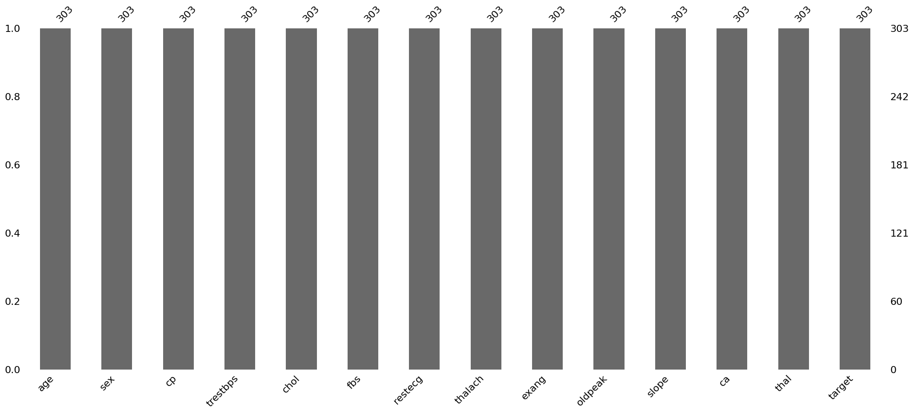
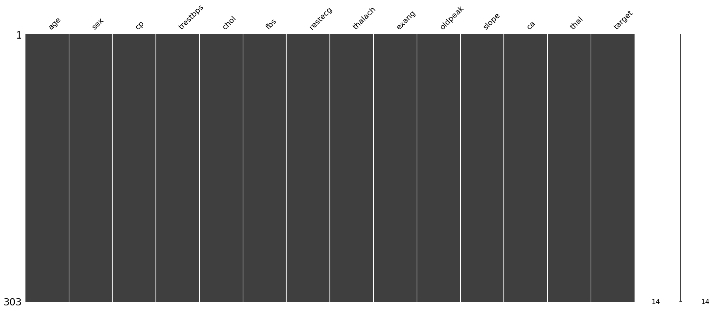
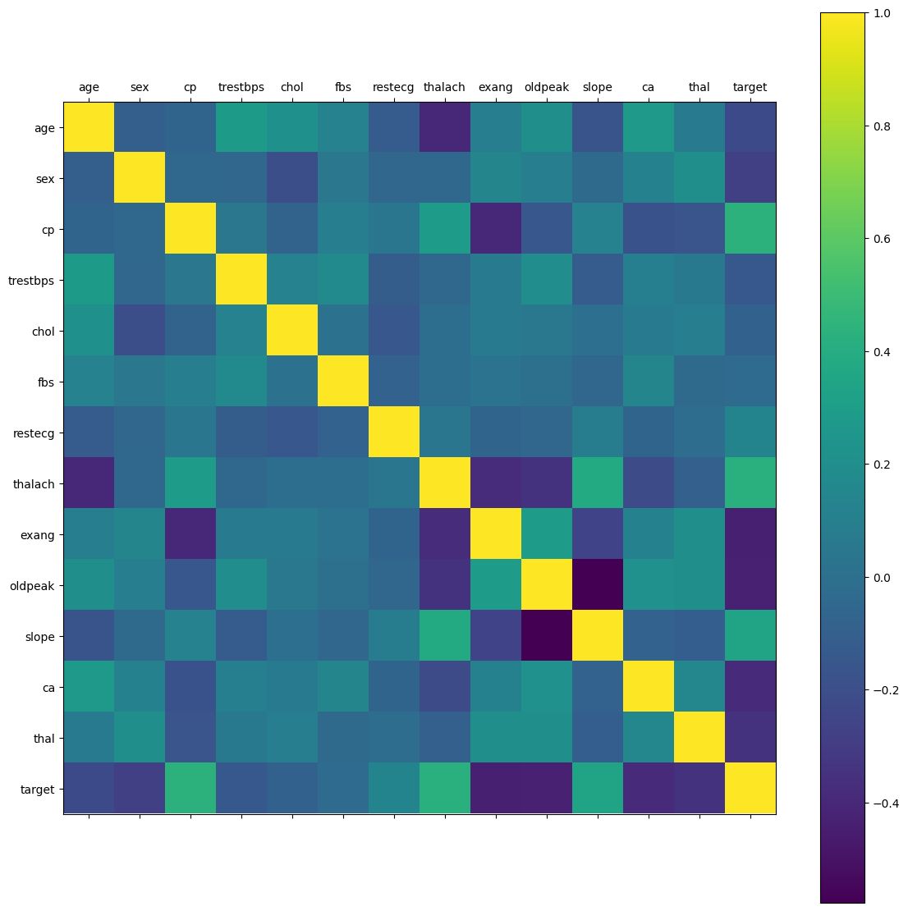
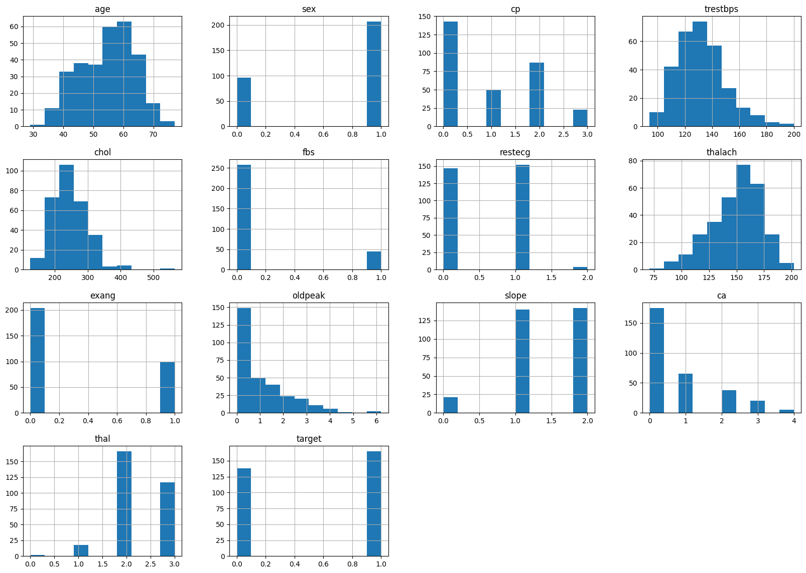
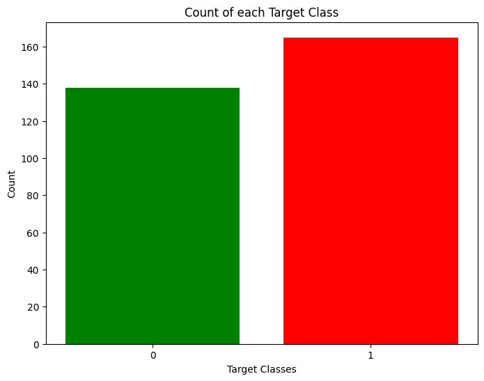
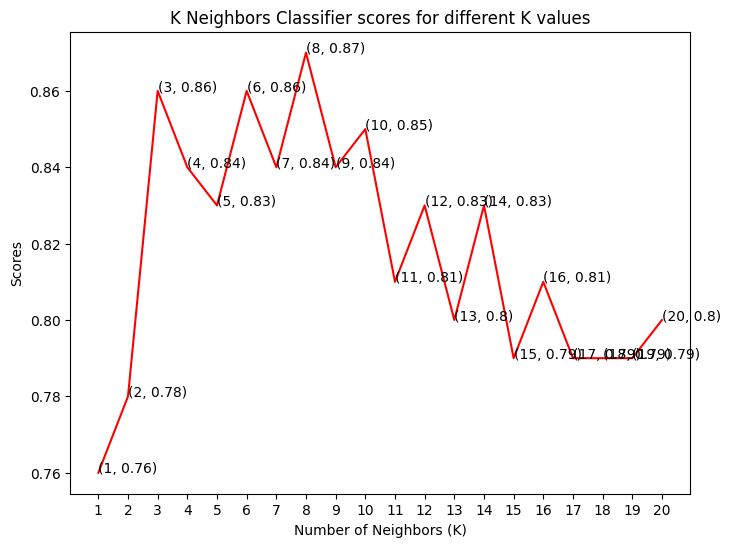
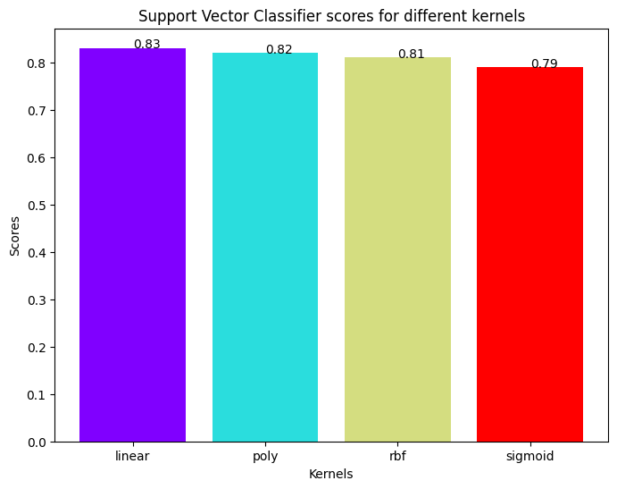
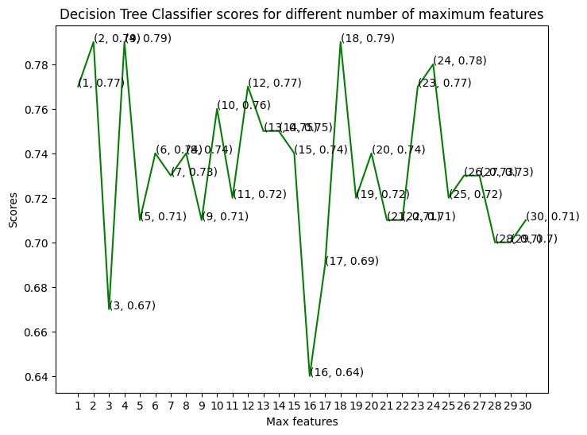
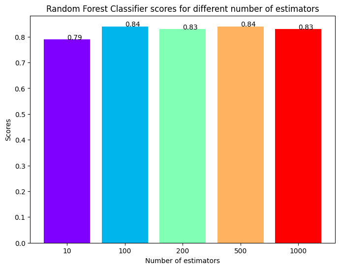

# Heart Disease Prediction

A machine learning notebook for predicting heart disease from clinical tabular data.


## Overview

This repository contains a Jupyter notebook that explores a heart disease dataset and compares several classification models. The goal is to predict the `target` column, where `0` represents no heart disease and `1` represents heart disease.

The notebook covers:

- loading the dataset
- checking missing values
- exploring feature distributions and correlations
- encoding categorical variables
- scaling numeric features
- training four classifiers
- comparing model accuracy
- saving a trained SVC model with pickle

The dataset source mentioned in the notebook is Kaggle: `ronitf/heart-disease-uci`.

## Repository Contents

```text
Heart_Disease_Prediction/
|-- Heart_Disease_Prediction.ipynb
|-- LICENSE
|-- README.md
|-- requirements.txt
|-- test.csv
|-- train.csv
`-- images/
    |-- correlation-matrix.png
    |-- decision-tree-max-features-comparison.png
    |-- feature-histograms.png
    |-- knn-score-comparison.png
    |-- missing-value-bar-chart.png
    |-- missing-value-matrix.png
    |-- random-forest-estimator-comparison.png
    |-- svc-kernel-comparison.png
    `-- target-class-distribution.png
```

## Dataset

The repository includes two CSV files with the same 14 columns.

| File | Rows | Columns |
| --- | ---: | ---: |
| `train.csv` | 1,024 | 14 |
| `test.csv` | 303 | 14 |

The notebook loads `test.csv` and then creates a train/test split from that file using:

```python
train_test_split(X, y, test_size=0.33, random_state=0)
```

Both CSV files contain 13 input features and 1 target column. No missing values were found in either file.

## Columns

| Column | Description |
| --- | --- |
| `age` | Patient age |
| `sex` | Sex encoded as a numeric category |
| `cp` | Chest pain type |
| `trestbps` | Resting blood pressure |
| `chol` | Serum cholesterol |
| `fbs` | Fasting blood sugar |
| `restecg` | Resting electrocardiographic result |
| `thalach` | Maximum heart rate achieved |
| `exang` | Exercise induced angina |
| `oldpeak` | ST depression induced by exercise relative to rest |
| `slope` | Slope of the peak exercise ST segment |
| `ca` | Number of major vessels |
| `thal` | Thalassemia result |
| `target` | Classification target. `0` means no heart disease and `1` means heart disease |

## Target Distribution

### `train.csv`

| Target | Count | Percentage |
| --- | ---: | ---: |
| `0` | 498 | 48.63% |
| `1` | 526 | 51.37% |

### `test.csv`

| Target | Count | Percentage |
| --- | ---: | ---: |
| `0` | 138 | 45.54% |
| `1` | 165 | 54.46% |

## Workflow

```text
Load CSV data
  |
Inspect rows, columns, and missing values
  |
Plot missing value summaries, histograms, and correlations
  |
One-hot encode categorical columns
  |
Scale numeric columns
  |
Split features and target
  |
Train classification models
  |
Compare accuracy scores
  |
Save the SVC model with pickle
```

## Preprocessing

The notebook applies one-hot encoding to these columns:

```text
sex, cp, fbs, restecg, exang, slope, ca, thal
```

It scales these numeric columns with `StandardScaler`:

```text
age, trestbps, chol, thalach, oldpeak
```

After encoding, the model input has 30 features.

## Exploratory Analysis

The notebook includes missing value plots, a correlation matrix, histograms for all columns, and a target class distribution chart.

In `test.csv`, the strongest positive correlations with `target` are:

| Feature | Correlation |
| --- | ---: |
| `cp` | 0.434 |
| `thalach` | 0.422 |
| `slope` | 0.346 |

The strongest negative correlations with `target` are:

| Feature | Correlation |
| --- | ---: |
| `exang` | -0.437 |
| `oldpeak` | -0.431 |
| `ca` | -0.392 |
| `thal` | -0.344 |
| `sex` | -0.281 |

## Models

| Model | Parameters tested |
| --- | --- |
| K Neighbors Classifier | `n_neighbors` from 1 to 20 |
| Support Vector Classifier | `linear`, `poly`, `rbf`, and `sigmoid` kernels |
| Decision Tree Classifier | `max_features` from 1 to 30 with `random_state=0` |
| Random Forest Classifier | `n_estimators` of 10, 100, 200, 500, and 1000 with `random_state=0` |

## Results

The scores below are the accuracy values saved in the notebook output.

| Model | Best accuracy | Setting |
| --- | ---: | --- |
| K Neighbors Classifier | 87.0% | `n_neighbors=8` |
| Random Forest Classifier | 84.0% | `n_estimators=100` or `500` |
| Support Vector Classifier | 83.0% | `kernel='linear'` |
| Decision Tree Classifier | 79.0% | `max_features=2`, `4`, or `18` |

K Neighbors Classifier has the highest saved score in the notebook at 87.0%.

## Plots

### Missing Value Bar Chart



### Missing Value Matrix



### Correlation Matrix



### Feature Histograms



### Target Class Distribution



### KNN Score Comparison



### SVC Kernel Comparison



### Decision Tree Max Features Comparison



### Random Forest Estimator Comparison



## Setup

Clone the repository:

```bash
git clone https://github.com/khushi0721/Heart_Disease_Prediction.git
cd Heart_Disease_Prediction
```

Create a virtual environment:

```bash
python -m venv .venv
```

Activate it on Windows:

```bash
.venv\Scripts\activate
```

Activate it on macOS or Linux:

```bash
source .venv/bin/activate
```

Install dependencies:

```bash
pip install -r requirements.txt
```

## Running the Notebook

Start Jupyter:

```bash
jupyter notebook
```

Open and run:

```text
Heart_Disease_Prediction.ipynb
```

## Current Limitations

- The notebook loads `test.csv` for analysis and training instead of using `train.csv` as the main training dataset.
- The final pickle cell saves the last trained SVC model as `svc_classifier.pkl`.
- The final prediction example raises a shape mismatch error because it passes 1 input feature to a model trained on 30 encoded features.
- The notebook reports accuracy only. It does not include precision, recall, F1 score, ROC AUC, or a confusion matrix for the trained models.

## Roadmap

- Move preprocessing and training code into Python scripts
- Build a single sklearn pipeline for preprocessing and inference
- Save the fitted preprocessing steps with the trained model
- Add precision, recall, F1 score, ROC AUC, and confusion matrix evaluation
- Add tests for preprocessing and prediction input shape
- Add a small API for prediction
- Add Docker support for reproducible local runs

## License

This project is licensed under the terms in the [LICENSE](LICENSE) file.
